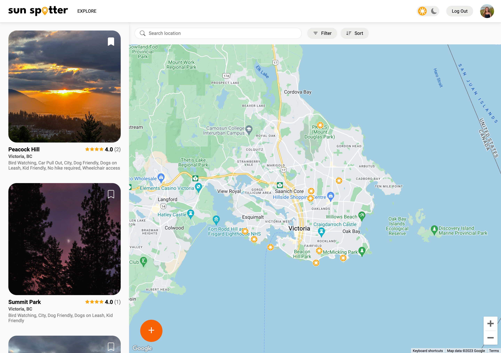
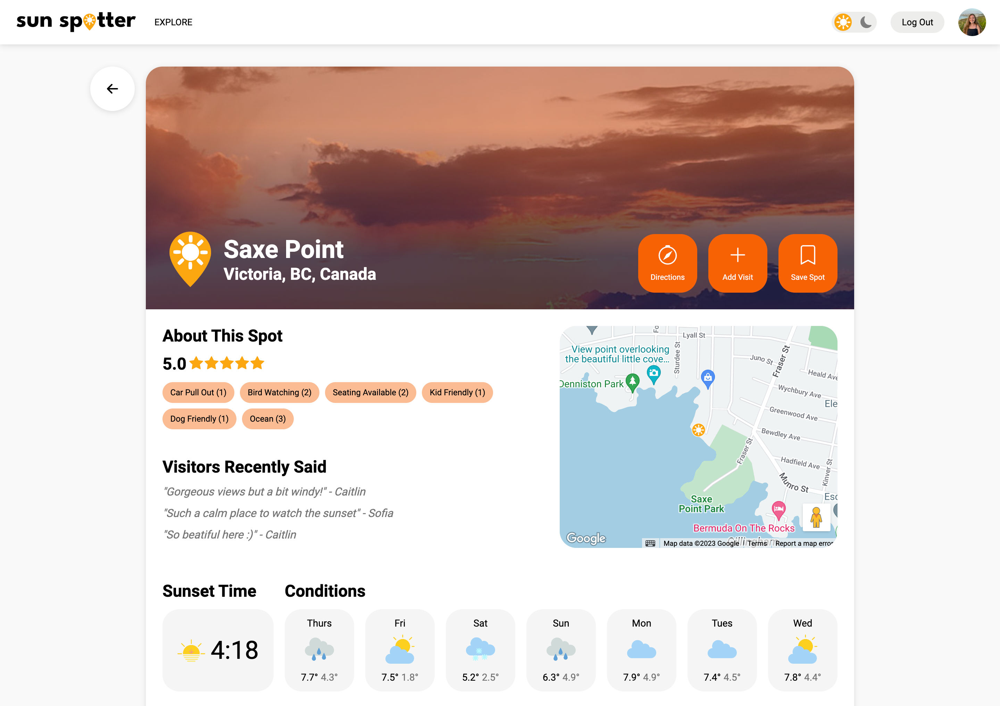
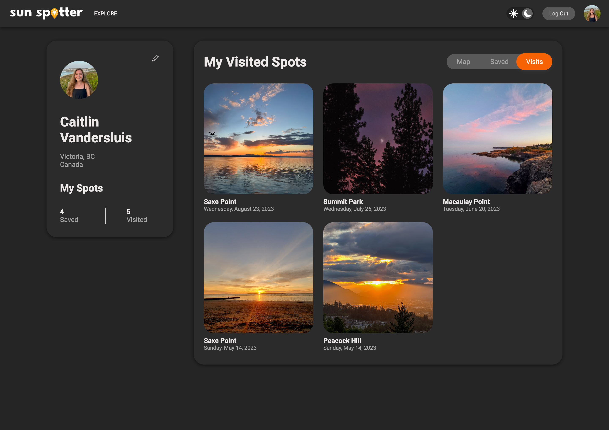
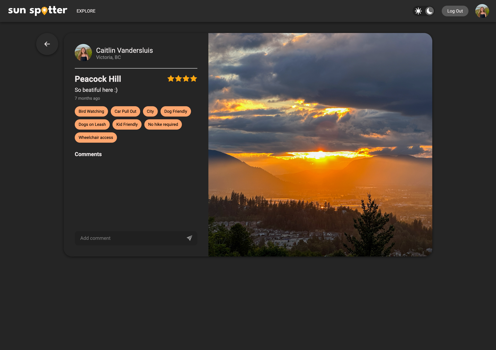

Sun Spotter
===========

A webapp for users to discover, discuss, and share their favourite local sunset spots in Victoria, BC.

## Contributors
- [Sofia Oliveira](https://github.com/sfia-o) 
- [Janay Ma](https://github.com/janaym)
- [Caitlin Vandersluis](https://github.com/cvsluis)

## Purpose
This project was built as a part of our learnings at [Lighthouse Labs](https://www.lighthouselabs.ca).

## Final Product
**Home Page**

**Explore Page**

**One Spot**

**Profile Page**

**One Visit**

## Features
**Browse Sunset Spots**
- Search by location, filter by labels, or sort by rating to find the perfect sunset spot
- Click on map pins to bring sunset spot into view
- Get overview of spot information for easy browsing

**View Details about Sunset Spot**
- Get local weather forecast and sunset time to help plan your next sunset viewing
- Use button to get directions to a particular sunset spot
- View more specific details about other's visits to that spot

**Create a Spot or Share a Visit**
- Easy to follow step by step form to save your sunset
- Add a description, some labels, a rating and a photo of the sunset
- Leave a comment on other sun-chasers photos

**View Profile Page with All Saved and Visited Spots**
- Save sunset spots to your profile for your future visits
- Look back on all of your sunsets with either a map or grid view
- Add profile information to share with other sun-chasers

**Dark Mode**
- Automatically applied dark mode between sunset and sunrise
- Swiftly switch to an easier on the eye interaction

## Getting Started
Clone the repository onto your local device.

### Backend 
1. Open backend with `cd backend/`

1. Create a local PostgreSQL database

2. Create the `.env` by using `.env.example` as a reference

3. Update the `.env` file with your correct local pg information

4. Install dependencies with `npm install`

5. Reset database: `npm run db:reset`

6. Run the server: `npm start`

### Frontend
1. Open a second terminal and open frontend with `cd frontend/`

3. Install dependencies with `npm install`

4. Run the server: `npm start`

## Dependencies
- [React](https://react.dev)
- [Express](https://expressjs.com)
- [Node.js](https://nodejs.org) v5.10.x or above
- [NPM](https://www.npmjs.com) 5.x or above
- [PG](https://www.npmjs.com/package/pg) 6.x