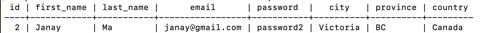

# Contributing to sun-spotter

Developer notes for how to contribute a full-stack feature to sun-spotter


## Table of Contents


- [Example](#stack-overview)
- [Queries](#queries)


## Example

Suppose you want to implement a full stack feature. For example, you want to create a webpage at the route http://localhost:3000/users that displays all the website users. To implement this, you will need to interact with every element of the stack. You will
  1 - Create a database query that will return all users
  2 - Set up a backend api route http://localhost:8080/api/users to host the above information
  3 - Create a front end route at http://localhost:3000/users using react-router that will host the page
  4 - Create the Users.jsx file that contains the html the page will display
  5 - Fetch the users data from the backend api route in the Users.jsx

## Queries

All of the app's queries live in the backend/src/db/queries folder. You will put your query the 0X_entity.js file that is most relevant to your query; for example, if you are trying to find information about users, put your query in the 02_spots.js file.

Each individual query takes the form of a function that returns a promise that resolves to the rows your query returns

```js
// <add description of what you are querying>
const getData = (params) => {
  const query = `your query here`;

  return db.query(query, [params])
    .then(data => {
      return data.rows;
    });
};
```
Here, **params** is any parameters that the query uses. You will replace **your query here** with a SQL query. For example, if you would like to get a user with a specific user id, you would do the following: 

```js
// Get user with specific id
const getOneUser = (userID) => {

  //inject parameters safely using `$1, $2, ..`, [param1, param2, param3] method
  const query = `SELECT * FROM users WHERE users.id = $1`;

  return db.query(query, [userID])
    .then(data => {
      return data.rows;
    });
};
```
If I called the above query with userID = 1, it would return a promise resolving to:



If your query is particularily complicated, it can be helpful to access the psql database with the command "psql -U labber -d sunspotter" and try out your query there. 

## Backend Routes

For our app to access our data, we need to host it on our api server, http://localhost:8080


 

